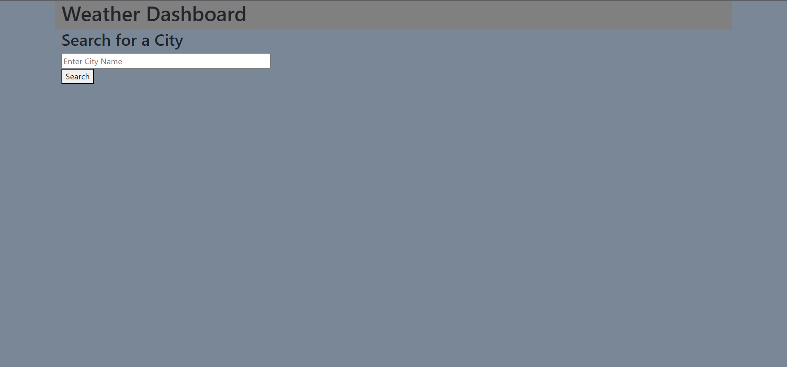

# five-day-weather
link to live site: https://gitkcb.github.io/five-day-weather/
github repo: https://github.com/gitkcb/five-day-weather
## Description
This application was created so the user could search for current and a five day weather forecast. I learned to use the weather api to provide the user with information about the upcoming weather. 
Provide a short description explaining the what, why, and how of your project. Use the following questions as a guide:

## Usage
The user can search a city and the current weather and five day forecast will show up on the page. Searches will be saved in local storage, but not displayed on the screen. 

.png)

